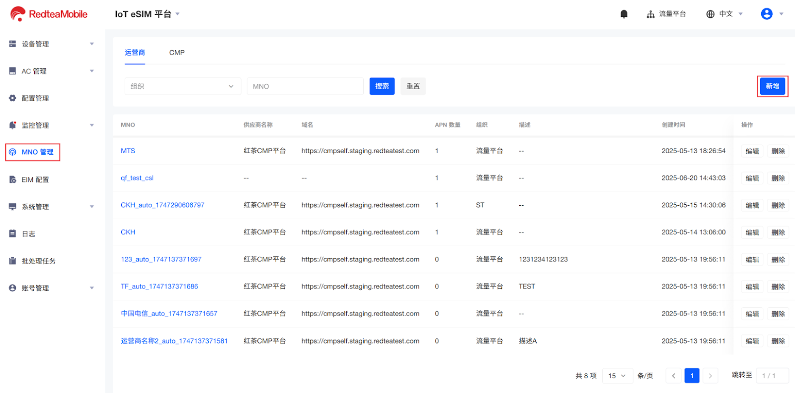

# 添加运营商

登录平台后，用户首先需添加运营商，以使平台通过调用运营商的接口查询码号信息。在授权之前需确认与运营商是合作关系，并且能拿到调用运营商OpenAPI接口的账号权限信息。



在左侧导航栏点击**MNO管理**，平台默认展示运营商页面。点击右上角的**新增**。

<figure><figcaption></figcaption></figure>



在右侧弹窗中输入运营商基本信息，并配置APN信息。如需添加多个APN，点击**新增**。字段描述参见表2。

<figure><figcaption></figcaption></figure>

| 字段      | 必填 | 描述                                                  | 示例      |
| ------- | -- | --------------------------------------------------- | ------- |
| MNO     | 是  | 为运营商自定义的名称。                                         | 演示运营商名称 |
| 组织      | 是  | 当前账号归属组织。                                           | 演示组织名称  |
| 供应商名称   | 否  | 选择供应商名称。名称和访问地址对应关系已在代码中写入，用户在界面进行选择，自动回显访问地址。      | 红茶CMP平台 |
| 供应商账号名称 | 否  | 选择供应商和组织。                                           | 测试账号    |
| 描述      | 否  | 自定义描述                                               | --      |
| APN名称   | 是  | 自定义的APN名称                                           | ctlte   |
| APN用户名  | 否  | APN用户名                                              | --      |
| APN密码   | 否  | APN的密码。                                             | 演示密码    |
| APN类型   | 是  | <ul><li>私网</li><li>公网</li></ul>                     | 私网      |
| APN SN  | 是  | 
手动选择APN编号。已创建的公网编号不可再次选择。

私网无编号，默认值为1。
 | 1       |


**说明**：


APN信息需从运营商获取，在分配AC时下发到设备，用于终端安装码号成功后通过该接入点接入网络。
\
如已选择私网，再添加APN时，类型为私网不可选；未选择私网，添加APN时，类型公网/私网都可选。




点击**确定**，并在确认弹窗中点击**确定**，以完成添加。

<figure><figcaption></figcaption></figure>


